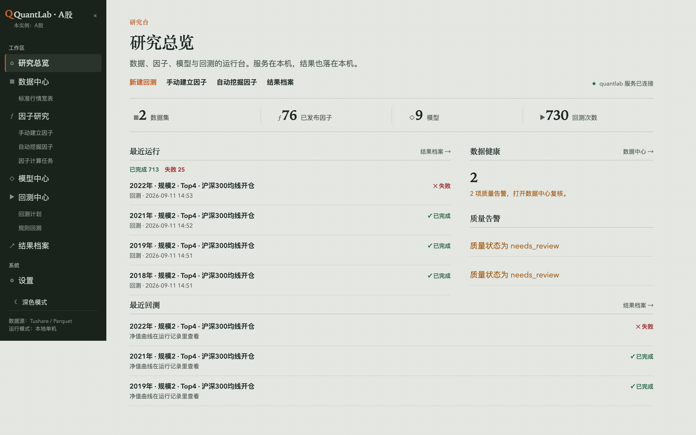
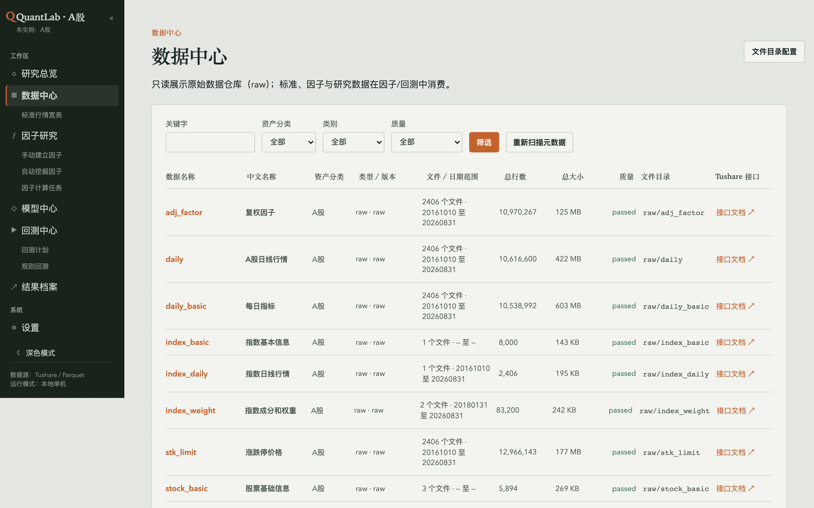
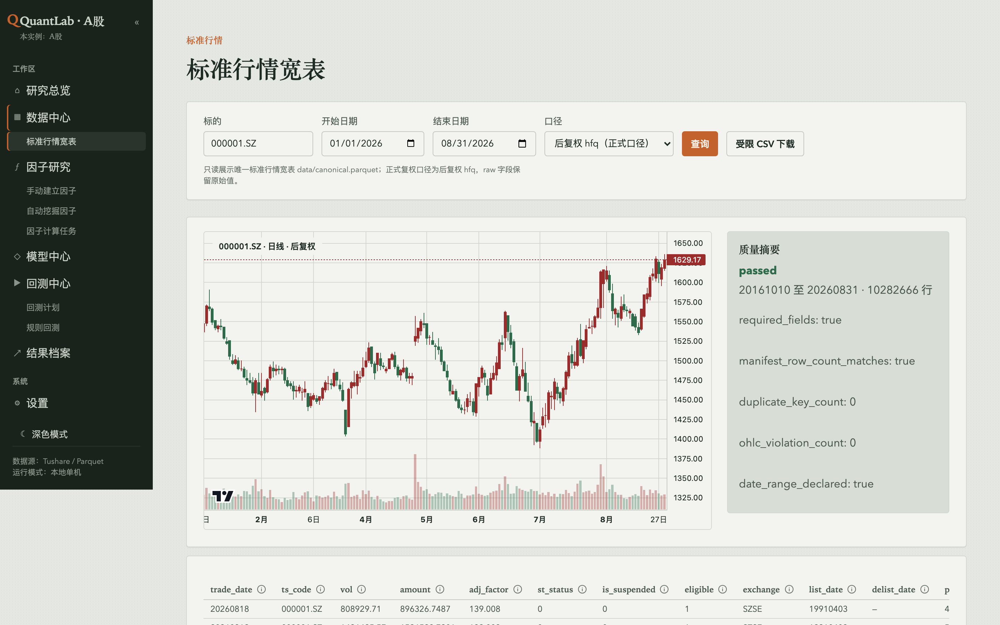
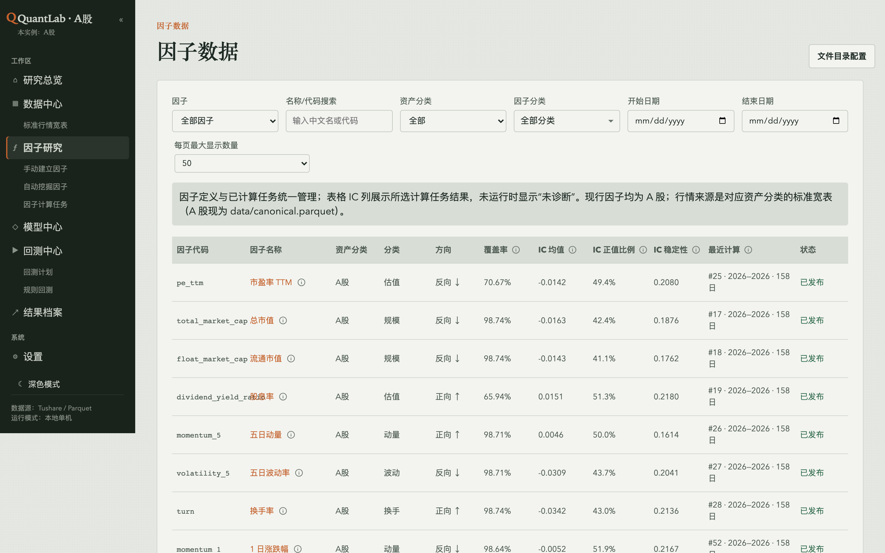
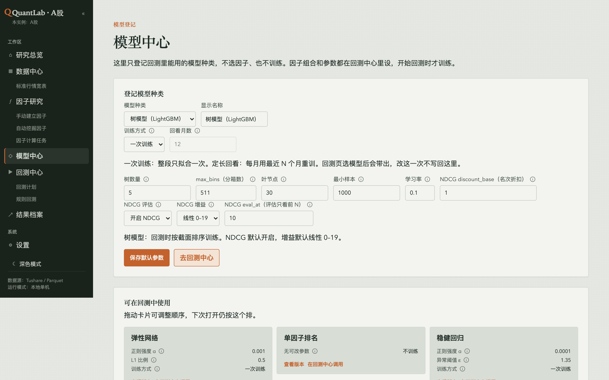
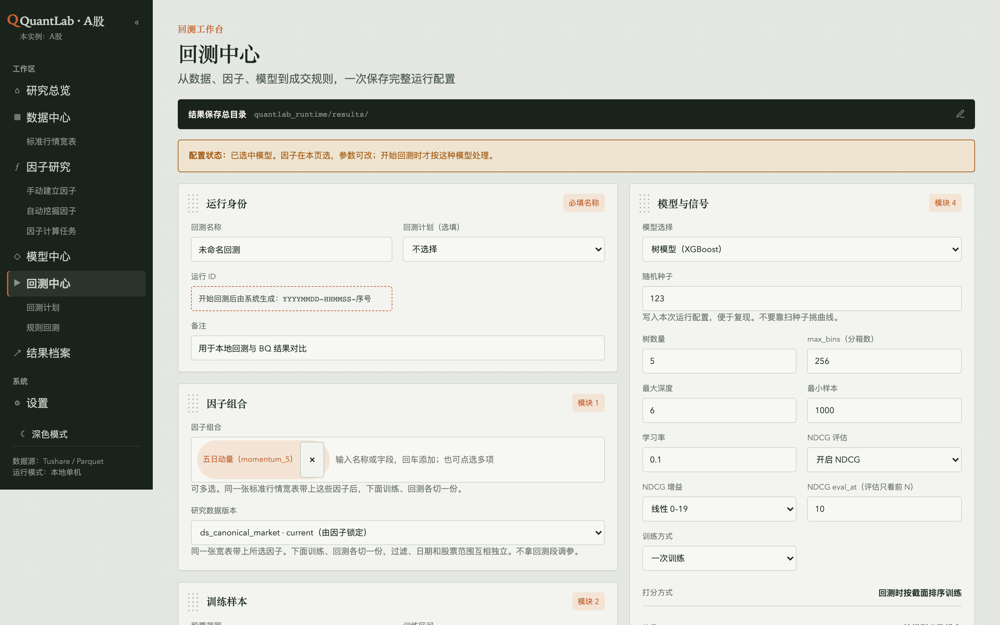
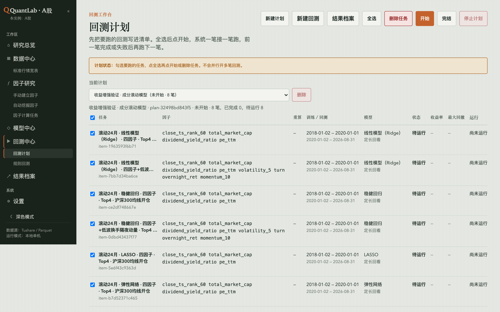
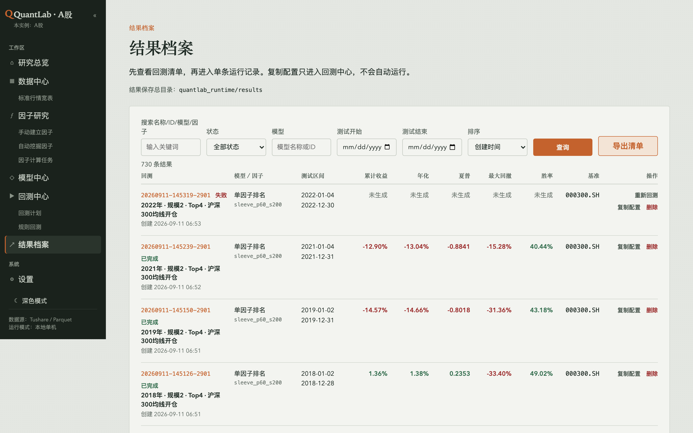

# QuantLab 方案介绍

本文说明 QuantLab 是什么、界面长什么样、怎么部署、研究原则是什么，以及如何联系。本仓库公开，只放介绍、界面截图和联系二维码；源码仓库保持私有。

| 项目 | 说明 |
|---|---|
| 产品 | QuantLab，本机量化研究与回测工作台 |
| 当前版本 | `0.1.0`（Alpha） |
| 默认资产 | A 股（可另起数字货币实例） |
| 本文仓库 | 公开的方案介绍、界面截图和微信二维码，不含源码和数据 |
| 源码仓库 | 私有，详见 [ACCESS.md](ACCESS.md) |

---

## 界面

本机浏览器工作台。下面截自正在运行的 A 股实例。设置页含 Token 和本机路径，不放在这里。

**研究总览** — 数据集、已发布因子、模型与回测次数，以及最近运行和质量告警。



**数据中心** — 只读展示原始数据仓库（raw）；标准、因子与研究数据在因子/回测中消费。



**标准行情宽表** — 按标的查询后复权 K 线，并显示质量摘要。



**因子数据** — 因子目录、覆盖率、IC 与发布状态。



**模型中心** — 只登记回测能用的模型种类，不选因子、也不在这里训练。



**回测中心** — 从数据、因子、模型到成交规则，一次保存完整运行配置。



**回测计划** — 把要跑的回测写进清单，全选后按顺序一笔接一笔跑。



**结果档案** — 先看清单，再进单条运行记录。复制配置只进入回测中心，不会自动运行。



---

## 1. 要解决什么问题

量化研究里，数据、因子、模型、回测和结果常常散落在不同脚本和目录里。常见后果是：

- 一次回测说不清用了哪一版行情、哪一版因子、哪组参数
- 页面或笔记本里复制了整份宽表，磁盘和口径容易漂
- 失败任务没有配置、日志和半成品，无法复核
- 训练、验证、测试边界不清，容易把未来信息写进信号

QuantLab 把这些收进同一个本机浏览器工作台：权威数据留在原目录只读使用，研究产物写入独立运行目录，每个结果都能追溯到数据版本、因子版本、策略版本、模型参数和交易参数。

---

## 2. 方案选择

| 方案 | 做法 | 结论 |
|---|---|---|
| A. 静态 HTML + JSON | 开发快，适合原型 | 无法安全读大型 Parquet，也不能跑训练和长时间回测 |
| B. 本地模块化单体 | FastAPI 提供页面和 API，SQLite 存元数据，PyArrow/Polars 读外部 Parquet，训练与回测走后台任务 | **采用**。单机研究部署简单，页面、业务、数据仓库边界清楚 |
| C. SPA + 多服务任务系统 | 扩展能力最强 | 需要独立前端构建链和队列，当前阶段成本高于收益 |

运行时不依赖 vn.py。本系统是独立项目。

---

## 3. 系统长什么样

```text
浏览器  →  FastAPI（页面 + API，默认 0.0.0.0:8765）
              ├─ SQLite          元数据、任务状态、注册表
              ├─ 本地 Parquet    行情与因子，只读，不搬进网站目录
              └─ 后台任务        因子计算、训练、回测
                     └─ quantlab_runtime/   日志、版本、每次回测独立目录
```

- 页面通过注册表和 API 按需读取，不把完整宽表复制进网站目录
- 容量、覆盖范围、质量状态由目录清单和元数据实时计算
- 局域网可再开同步端口（默认 `8766`）：只做文件发现与补缺，不提供页面、不开库、不传 Token

---

## 4. 工作台能力

启动后本机打开 http://127.0.0.1:8765/ ；同一局域网的其他电脑打开 `http://<这台机器的局域网IP>:8765/` 。

| 模块 | 路径 | 作用 |
|---|---|---|
| 研究总览 | `/` | 数据集、因子、最近运行与质量告警 |
| 数据中心 | `/data` | 已登记数据集、版本、覆盖范围与质量 |
| 标准行情宽表 | `/kline` | 只读查询 raw / 后复权 K 线 |
| 因子研究 | `/factors` | 因子目录、诊断与详情 |
| 手动建立因子 | `/factors/new/manual` | 写公式并登记入库 |
| 自动挖掘因子 | `/research/factor-mining` | 从宽表搜索候选表达式 |
| 因子计算任务 | `/research/factor-jobs` | 计算任务与进度 |
| 模型中心 | `/models` | 登记回测可用的模型种类 |
| 回测中心 | `/backtests/new` | 冻结数据、因子、模型与撮合规则后开跑 |
| 回测计划 | `/backtests/plan` | 勾选任务，按顺序串行执行 |
| 规则回测 | `/backtests/rules` | 内置规则模板，不训练模型 |
| 结果档案 | `/backtests/runs` | 历史运行、指标、产物与复制配置 |
| 设置 | `/settings` | 路径、资产版本、端口、运算资源、草稿默认参数 |

模型种类包括 LightGBM / XGBoost 排序树，以及随机森林、Ridge、Lasso 等回归模型。因子组合和训练参数在回测中心设置，**开始回测时才训练**。

---

## 5. 研究与回测原则

1. **权威数据只读。** `data/` 与校准目录保持原位，不覆盖、不搬迁。研究计算写入新版本或独立运行目录。
2. **成交与因子用后复权。** 正式字段为 `hfq_open`、`hfq_high`、`hfq_low`、`hfq_close`。
3. **版本不可变。** 因子、模型、策略、数据集和回测都带稳定 ID 与版本或运行快照。历史记录不覆盖。
4. **点时与样本外。** 训练集、验证集、测试集严格分离。测试过滤不能引用未来收益或标签。
5. **信号与执行分开。** 默认 t 收盘出信号、t+1 后复权开盘买入、t+2 后复权收盘卖出。调仓间隔与持仓天数不是同一件事。
6. **门禁后再跑。** 回测提交前检查版本状态、数据质量、样本量、时间边界、字段、模型规范、资金和费用。门禁失败不建记录、不排队。
7. **失败也留档。** 配置、日志、错误和已生成文件都保留，不静默重试。
8. **复制不等于再跑。** 从历史运行复制配置只进入草稿。自动挖掘只产生候选和研究记录，不自动发布因子。
9. **一次只跑一条回测。** 并行指的是一条回测内部的折/分层计算，不是同时开多条回测。
10. **本地排序模型如实标注。** `DateGroupedRanker` 是本地排序代理，不宣称复刻任何商业平台的私有模型。

回测可配置项包括：训练/测试区间与过滤、Top N、等权或分数加权、调仓间隔、买卖费率与最低费用、印花税、滑点、手数、价格精度、未成交策略、初始资金、基准（沪深 300）。全部写入不可变配置快照。

---

## 6. 数据与运行边界

默认读取仓库下的 `data/`，运行产物写入 `quantlab_runtime/`（都不进 git）。

| 根目录 | 默认位置 | 用途 |
|---|---|---|
| 项目根 | 当前工作目录 | 代码与配置边界 |
| 行情与标准宽表 | `<project>/data` | 权威行情，只读 |
| 校准 / 实验产物 | `<project>/data/calibration` | 校准与实验，登记后才可用 |
| 运行时 | `<project>/quantlab_runtime` | SQLite、任务、因子版本、回测结果 |

标准行情来自 `data/canonical.parquet`（每股票每日一行）。已有数据仓库可以只改路径配置，不必搬文件。

**不要**用 git 或拷盘同步：

- `quantlab_runtime/db/`、`config/`（机器码、运算设置、Token）
- 完整 `results/` 镜像删除

局域网多机时：各台使用自己的 SQLite；产物互相补缺（已有目录不覆盖）；行情可从指定源头拉取。只发现同一资产版本，A 股实例不要和数字货币实例互相同步。

---

## 7. 部署形态

- **环境：** Python 3.10+，macOS 或 Linux
- **监听：** 页面默认 `0.0.0.0:8765`，局域网同步默认 `8766`，两个端口必须不同
- **绑定限制：** `--host` 只接受 `127.0.0.1`、`0.0.0.0` 或 RFC1918 地址，不能绑公网 IP
- **资产隔离：** 数字货币请另起目录，并标明资产与端口（例如页面 `8775`、同步 `8776`）

启动：

```bash
python3 -m venv .venv
source .venv/bin/activate
pip install -e ".[dev]"
quantlab init-db
quantlab serve
```

本机打开 http://127.0.0.1:8765/ 。16GB 内存机器请把分层进程数设为 `1`，不要按 CPU 核数开满。

---

## 8. 当前阶段

- 版本 `0.1.0`，Alpha
- 目标是本机可复现的研究工作台，不是托管云平台，也不是实盘交易系统
- 源码、行情、Token、回测产物均不在本仓库
- 源码在独立私有仓库维护；需要阅读代码时，由所有者另行按 Read 邀请，不要默认给 Write

---

## 9. 本仓库怎么用

1. 本仓库可见性：**Public**，发链接即可阅读
2. 源码仓库 `quantlab` 保持 **Private**
3. 需要阅读源码时，由所有者按 Read 邀请；步骤见 [ACCESS.md](ACCESS.md)

---

## 10. 联系方式

有问题、要演示或要源码阅读权限，请加微信。

| 项目 | 内容 |
|---|---|
| 微信名 | Jackey |
| GitHub | [zwm521gmailcom](https://github.com/zwm521gmailcom) |

扫码添加：


---

源码、数据和 Token 不在本仓库。请勿把它们提交到这里。
